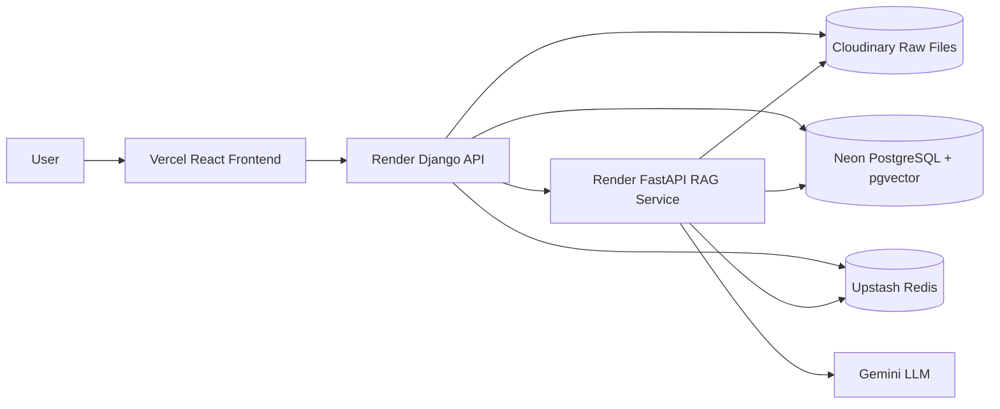
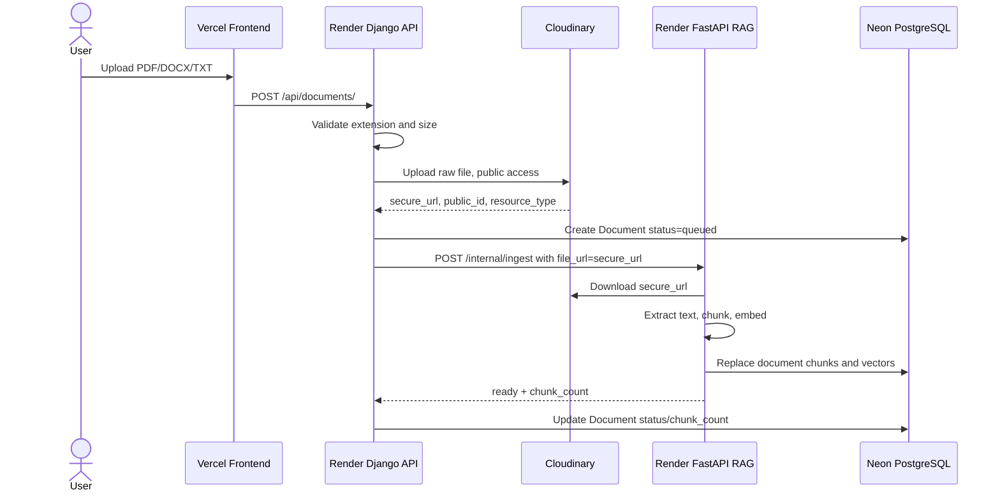
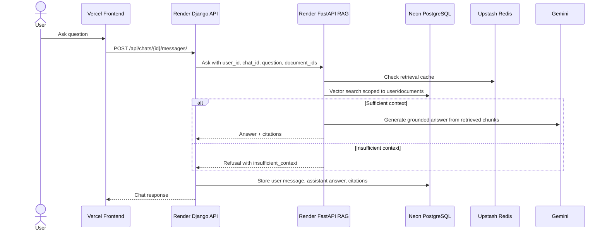
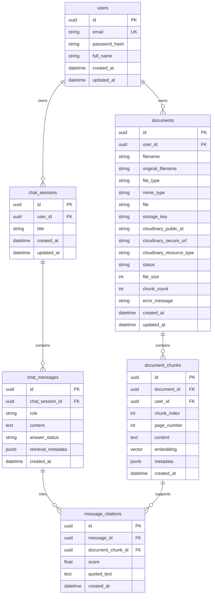
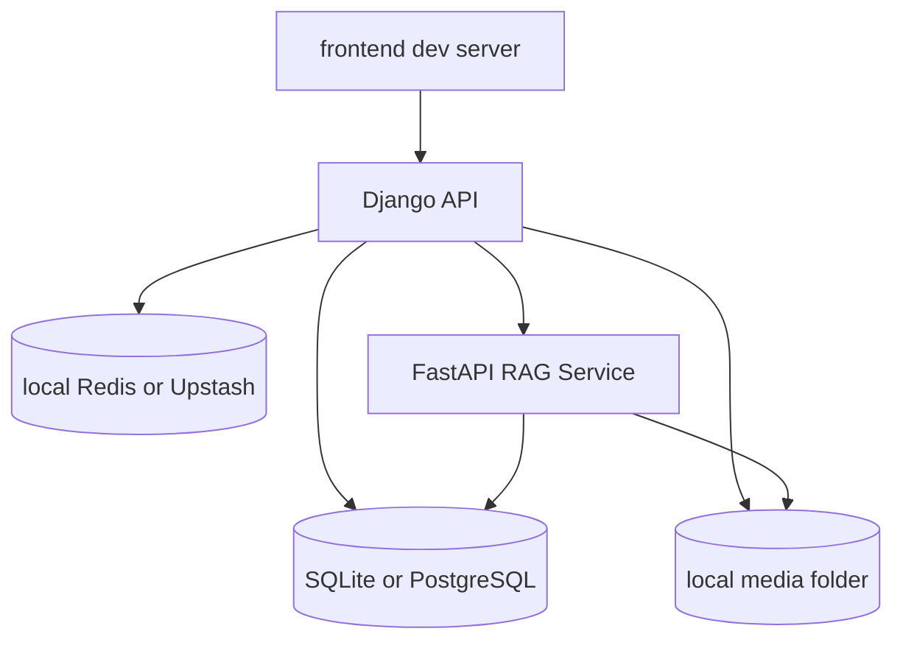
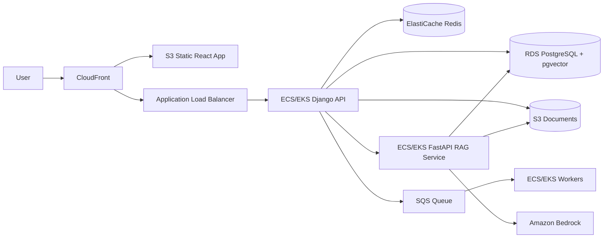
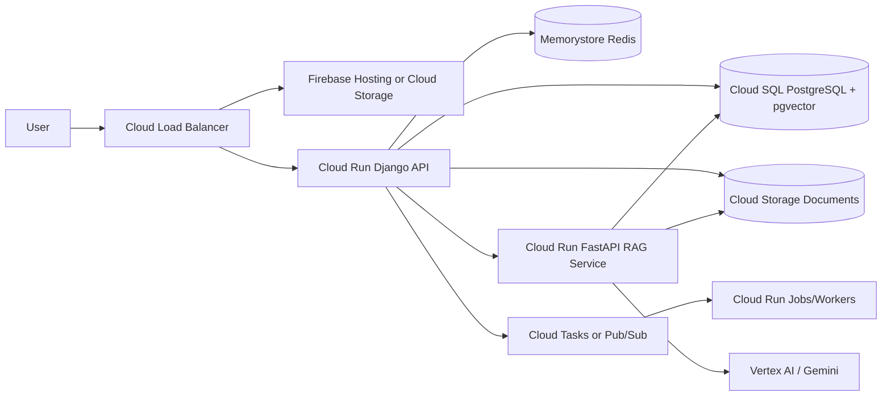

# Architecture

## Goal

DocuMind AI lets authenticated users upload PDF, DOCX, and TXT files, ask questions over selected sources, and receive grounded answers with citations. The production deployment separates the frontend, Django API, and FastAPI RAG service, so shared file storage is handled through Cloudinary rather than local container filesystems.

## Production Deployment



## Service Responsibilities

| Service | Hosted on | Responsibility |
| --- | --- | --- |
| React frontend | Vercel | Landing page, auth UI, uploads, dashboard, sidebar stats, chat, citations |
| Django REST API | Render | Auth, permissions, Cloudinary uploads, document metadata, chat APIs, dashboard stats |
| FastAPI RAG service | Render | Remote file download, extraction, chunking, embeddings, retrieval, grounded generation |
| PostgreSQL + pgvector | Neon | Users, documents, chunks, chats, messages, citations, vector search |
| Redis | Upstash | Retrieval/answer cache and task infrastructure |
| Cloudinary | Cloudinary | Shared raw storage for uploaded PDF/DOCX/TXT files |
| Gemini | Google AI | Provider-backed answer generation when configured |

## Document Upload And Ingestion



Important details:

- Django uploads to Cloudinary with `resource_type="raw"`, `type="upload"`, `access_mode="public"`, `use_filename=True`, and `unique_filename=True`.
- Django stores `cloudinary_secure_url` and also sets `storage_key` to that secure URL.
- FastAPI receives `file_url` and downloads it into `/tmp/documindai_ingest/`.
- FastAPI deletes downloaded temp files after ingestion.
- If `file_url` is absent, FastAPI falls back to local `storage_key` ingestion for local development.

## Grounded Question Answering



## Data Model Highlights

The `documents_document` table stores both local-development metadata and Cloudinary metadata:

- `filename`
- `original_filename`
- `file_type`
- `mime_type`
- `file`
- `storage_key`
- `cloudinary_public_id`
- `cloudinary_secure_url`
- `cloudinary_resource_type`
- `status`
- `file_size`
- `chunk_count`
- `error_message`

The `documents_documentchunk` table stores extracted chunks and embeddings. In production, Neon PostgreSQL uses `pgvector` for vector search.

## RAG Pipeline

1. Django validates file extension and max size.
2. Django uploads the original file to Cloudinary as a public raw asset.
3. Django sends the Cloudinary `secure_url` to FastAPI as `file_url`.
4. FastAPI downloads the file using `httpx.Client(...).get(...)`.
5. FastAPI extracts text:
   - PDF: `pypdf`
   - DOCX: `python-docx`
   - TXT: safe text decoding
6. FastAPI normalizes and chunks text with source metadata.
7. FastAPI generates embeddings and stores chunks/vectors in Neon.
8. Questions are embedded, retrieved against user-scoped chunks, and answered with citations.

## Deployment Configuration

### Frontend on Vercel

- Build: Vite React
- API target: Render Django API
- Does not store Cloudinary secrets

### Django API on Render

Required services:

- Neon `DATABASE_URL`
- Upstash Redis URL values
- Render FastAPI `RAG_SERVICE_URL`
- Cloudinary credentials

Recommended build command:

```bash
pip install -r requirements.txt && python manage.py migrate && python manage.py collectstatic --noinput
```

### FastAPI RAG on Render

Required services:

- Neon `DATABASE_URL`
- Upstash Redis URL
- Gemini API key when `LLM_PROVIDER=gemini`

FastAPI does not need Cloudinary secrets. It downloads from the public Cloudinary `secure_url` stored by Django.

## Security Notes

- Cloudinary API secret stays only in Django backend environment variables.
- The frontend uploads files only to Django, never directly to Cloudinary.
- Every document, chat, chunk, and citation query is scoped by authenticated user.
- FastAPI internal endpoints should be treated as backend-only service endpoints.
- Prompt generation is instructed to answer only from retrieved context.

## Database Schema



## Key Tables And Indexes

| Table | Important indexes |
| --- | --- |
| `users` | unique email |
| `documents` | `(user_id, status)`, `(created_at)` |
| `document_chunks` | `(user_id, document_id)`, vector index on `embedding` when pgvector is enabled |
| `chat_sessions` | user-scoped listing through ownership |
| `chat_messages` | chat-session message history |
| `message_citations` | message-to-source attribution |

For the current deployment, Neon PostgreSQL with `pgvector` keeps vector search and relational metadata in one managed database. At larger scale, vector retrieval can move to OpenSearch, Pinecone, Weaviate, Vertex AI Vector Search, or Amazon OpenSearch Serverless.

## Citation Grounding Rules

- Every factual answer must be supported by retrieved document chunks.
- The generation prompt instructs the LLM to answer only from supplied context.
- If retrieved chunks are not strong enough, the API returns `insufficient_context`.
- The frontend displays citation cards with source filename, page number when available, score, and supporting text.
- Document text is treated as untrusted context to reduce prompt-injection risk.

## Caching Strategy

| Cache | Key shape | TTL | Notes |
| --- | --- | --- | --- |
| Retrieval cache | `retrieval:{user_id}:{query_hash}:{doc_scope_hash}` | Configured by `RETRIEVAL_CACHE_TTL_SECONDS` | Stores retrieval/answer payloads in Redis-compatible cache |
| Dashboard stats | dashboard query cache | short-lived | Invalidated on upload/delete/chat activity |
| Auth/rate limit | future extension | window-based | Can be layered on Upstash Redis |

Cache invalidation happens when users upload, delete, or reprocess documents, and when chat/session data changes. The document scope changes with selected document IDs, so retrieval remains user-scoped.

## Scalability Plan

- Keep Vercel frontend separate from backend APIs.
- Keep Django API separate from FastAPI RAG service so chat/upload APIs do not block on extraction or model latency.
- Keep uploaded files outside service containers through Cloudinary shared storage.
- Use Neon indexes and pgvector for tenant-scoped retrieval.
- Use Upstash Redis for cache and task infrastructure.
- Make FastAPI stateless aside from `/tmp` ingestion files that are deleted after processing.
- Make ingestion idempotent by replacing chunks for a document during re-ingestion.
- Add structured logs around Cloudinary upload, remote download, extraction, chunk count, retrieval latency, and LLM failures.
- Move to dedicated worker queues if document volume grows beyond the current background/eager ingestion setup.

## Local Development Architecture



Local development can work without Cloudinary credentials. When Cloudinary is not configured, Django saves the local `file` field and FastAPI resolves `storage_key` under `DOCUMENT_STORAGE_ROOT`.

## AWS Alternative Architecture



Recommended AWS services:

- Frontend: S3 + CloudFront
- API services: ECS Fargate for simpler operations, EKS if Kubernetes is required
- Database: RDS PostgreSQL with `pgvector`
- Cache: ElastiCache Redis
- File storage: S3 with signed URLs or private object access
- Queue: SQS or Redis broker
- AI: Amazon Bedrock for embeddings/generation
- Secrets: AWS Secrets Manager
- Observability: CloudWatch, X-Ray, structured logs

## GCP Alternative Architecture



Recommended GCP services:

- Frontend: Firebase Hosting or Cloud Storage behind Cloud CDN
- API services: Cloud Run for Django and FastAPI
- Database: Cloud SQL PostgreSQL with `pgvector`, or managed vector search for larger scale
- Cache: Memorystore Redis
- File storage: Cloud Storage
- Queue: Cloud Tasks or Pub/Sub
- AI: Vertex AI/Gemini for embeddings and generation
- Secrets: Secret Manager
- Observability: Cloud Logging, Cloud Trace, Error Reporting

## Production Practices

- JWT authentication with protected APIs.
- Per-user authorization on documents, chunks, chats, and citations.
- File extension, MIME, size, and content validation before ingestion.
- Cloudinary credentials only in Django backend env vars.
- Render/Vercel/Neon/Upstash secrets managed through platform environment variables.
- CORS restricted to deployed frontend domains.
- FastAPI internal endpoints should not be exposed as public user-facing APIs.
- Tests cover auth boundaries, file validation, chunking, retrieval filtering, Cloudinary metadata, and insufficient-context responses.

## Suggested Repository Structure

```text
.
├── frontend/
│   └── src/
├── backend-django/
│   ├── config/
│   ├── accounts/
│   ├── documents/
│   ├── chats/
│   └── dashboard/
├── ai-service-fastapi/
│   ├── app/
│   │   ├── api/
│   │   ├── core/
│   │   ├── db/
│   │   └── rag/
│   └── tests/
├── docs/
└── README.md
```
