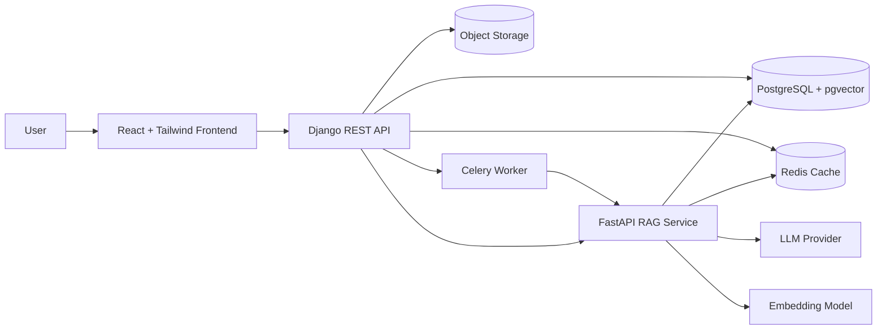
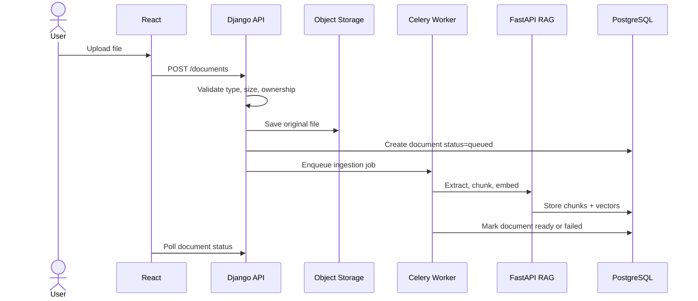
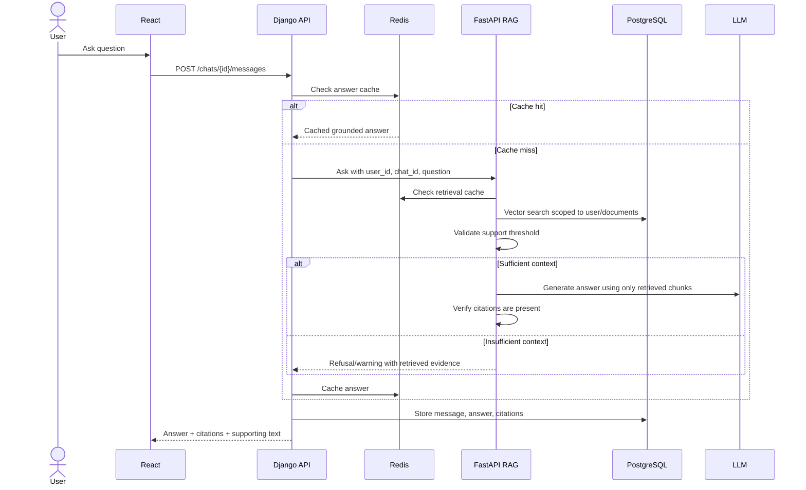
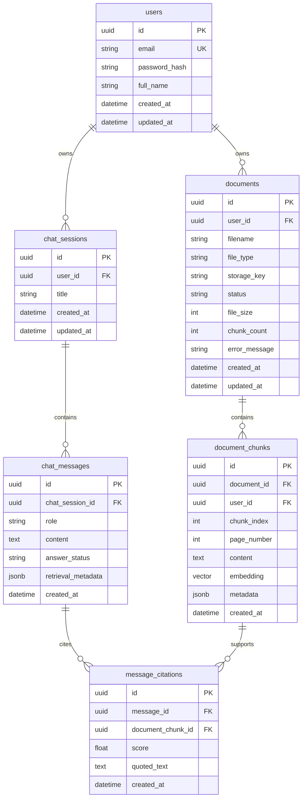
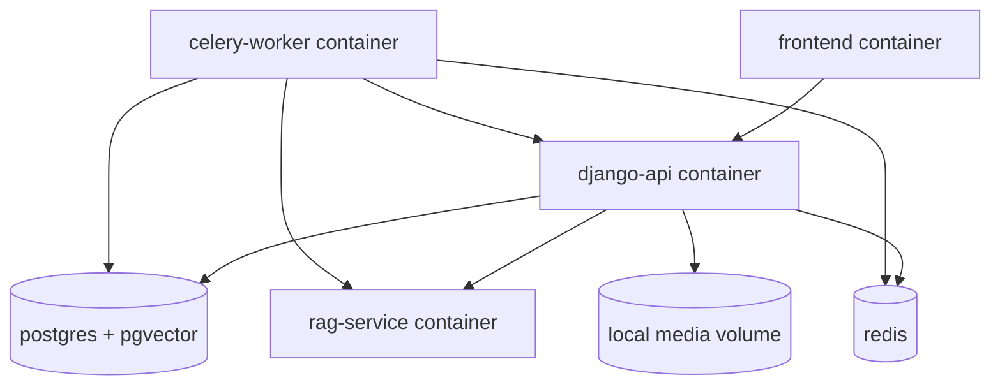
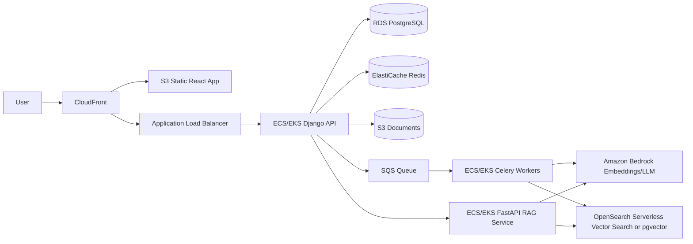
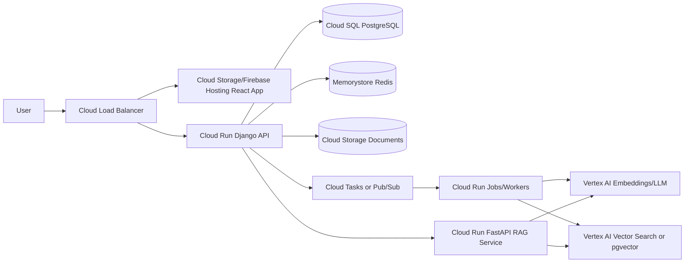

# Architecture

## Goal

Build a scalable RAG application where each user can upload PDF, DOCX, or TXT files, ask questions, and receive answers that are strictly grounded in retrieved document chunks. If retrieval cannot support an answer, the system must warn the user instead of guessing.

## High-Level System



## Service Responsibilities

| Service | Responsibility |
| --- | --- |
| React frontend | Auth screens, document upload, ingestion status, chat, citations, dashboard |
| Django REST API | User auth, permissions, file validation, document metadata, chat sessions, audit records |
| FastAPI RAG service | Text extraction, chunking, embeddings, vector retrieval, grounded generation |
| Celery worker | Long-running document ingestion and embedding jobs |
| PostgreSQL + pgvector | Users, documents, chunks, chats, messages, citations, vector search |
| Redis | Query cache, retrieval cache, dashboard stats cache, Celery broker |
| Object storage | Original uploaded files |

## Main User Flows

### Document Upload And Ingestion



### Grounded Question Answering



## Database Schema



## Key Tables And Indexes

| Table | Important indexes |
| --- | --- |
| `users` | unique email |
| `documents` | `(user_id, status)`, `(created_at)` |
| `document_chunks` | `(user_id, document_id)`, vector index on `embedding`, optional full-text index on `content` |
| `chat_sessions` | `(user_id, updated_at)` |
| `chat_messages` | `(chat_session_id, created_at)` |
| `message_citations` | `(message_id)`, `(document_chunk_id)` |

For local and assignment scope, `pgvector` keeps the architecture simple. For larger scale, vector search can move to OpenSearch, Pinecone, Weaviate, Vertex AI Vector Search, or Amazon OpenSearch Serverless.

## RAG Pipeline

1. Validate file extension, MIME type, and size.
2. Store original file in object storage.
3. Extract text:
   - PDF: `pypdf` or `pdfplumber`
   - DOCX: `python-docx`
   - TXT: safe text decode
4. Normalize text and preserve metadata such as page number and source filename.
5. Chunk text using token-aware chunking, around 700-1,000 tokens with 100-150 token overlap.
6. Generate embeddings and store vectors with chunk metadata.
7. For a question, embed query and retrieve top-k chunks scoped to the authenticated user.
8. Apply score threshold and optional reranking.
9. Generate answer with a strict prompt that only allows facts from retrieved chunks.
10. Return answer, citation IDs, source document names, page numbers, scores, and exact supporting text.

## Citation Grounding Rules

- Every factual sentence should be supported by at least one retrieved chunk.
- The model prompt must instruct the LLM to answer only from supplied context.
- If retrieved chunks are below the similarity threshold, return `insufficient_context`.
- If the generated answer lacks citations or introduces unsupported claims, return a warning or regenerate once.
- The frontend must display citation cards with source filename, page number when available, chunk score, and supporting text.

## Caching Strategy

| Cache | Key shape | TTL | Notes |
| --- | --- | --- | --- |
| Query answer cache | `answer:{user_id}:{question_hash}:{doc_scope_hash}` | 10-30 min | Stores final answer and citations |
| Retrieval cache | `retrieval:{user_id}:{query_hash}:{doc_scope_hash}` | 10-30 min | Stores top chunk IDs and scores |
| Dashboard stats | `dashboard:{user_id}` | 1-5 min | Document count, ready count, chats, questions |
| Auth/rate limit | `rate:{user_id}:{window}` | window-based | Prevents abuse |

Cache invalidation happens when a user uploads, deletes, or reprocesses a document. The document scope hash should change when the user knowledge base changes.

## Scalability Plan

- Separate user-facing API from AI inference so uploads and chat APIs do not block on embedding or LLM latency.
- Run ingestion asynchronously through Celery workers.
- Keep object files outside the API container in S3/GCS-compatible storage.
- Store document and chat metadata relationally, with indexes scoped by `user_id`.
- Use vector indexes and metadata filtering for fast tenant-scoped retrieval.
- Add Redis caching for repeated queries, retrieval results, dashboard stats, and rate limits.
- Make workers horizontally scalable by processing independent document jobs.
- Make FastAPI stateless so it can scale behind a load balancer.
- Use idempotent ingestion jobs so retries do not duplicate chunks.
- Add observability around ingestion duration, retrieval latency, cache hit rate, LLM failures, and citation rejection rate.

## Local Container Architecture



## AWS Architecture



Recommended AWS services:

- Frontend: S3 + CloudFront
- API services: ECS Fargate for simpler operations, EKS if Kubernetes is required
- Database: RDS PostgreSQL with `pgvector`
- Vector search: start with RDS `pgvector`; use OpenSearch Serverless for larger data and dedicated vector retrieval
- Cache: ElastiCache Redis
- File storage: S3 with private buckets and pre-signed upload/download if needed
- Queue: SQS or Redis broker; SQS is better for production durability
- AI: Amazon Bedrock for embeddings and generation
- Secrets: AWS Secrets Manager
- Observability: CloudWatch, X-Ray, structured logs

## GCP Alternative Architecture



Recommended GCP services:

- Frontend: Firebase Hosting or Cloud Storage behind Cloud CDN
- API services: Cloud Run for Django and FastAPI
- Database: Cloud SQL PostgreSQL
- Vector search: Vertex AI Vector Search for scale, or `pgvector` in Cloud SQL for assignment scope
- Cache: Memorystore Redis
- File storage: Cloud Storage
- Queue: Cloud Tasks for job dispatch or Pub/Sub for event-driven ingestion
- AI: Vertex AI embeddings and Gemini models
- Secrets: Secret Manager
- Observability: Cloud Logging, Cloud Trace, Error Reporting

## Security And Production Practices

- JWT or session authentication with protected APIs.
- Per-user authorization on every document, chat, and chunk lookup.
- File type, MIME, size, and content validation before ingestion.
- Private object storage with signed URLs if direct access is needed.
- Rate limits on auth, upload, and chat endpoints.
- Prompt injection defense by treating document text as untrusted context.
- Secrets stored in environment variables locally and managed secret stores in cloud.
- Structured logs with request IDs across Django, worker, and FastAPI.
- Tests for auth boundaries, file validation, chunking, retrieval filtering, and insufficient-context responses.

## Suggested Repository Structure

```text
.
├── backend/
│   ├── config/
│   ├── accounts/
│   ├── documents/
│   ├── chats/
│   └── common/
├── rag_service/
│   ├── app/
│   │   ├── extraction/
│   │   ├── chunking/
│   │   ├── embeddings/
│   │   ├── retrieval/
│   │   └── generation/
│   └── tests/
├── frontend/
│   └── src/
├── docs/
├── docker-compose.yml
└── README.md
```

